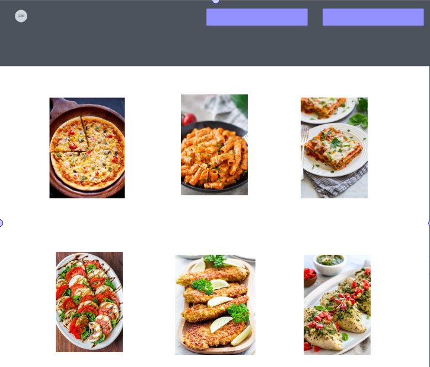
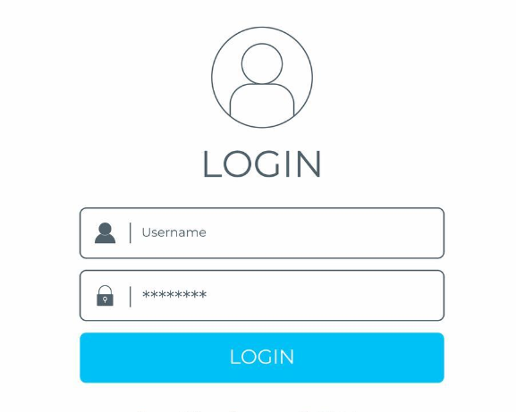
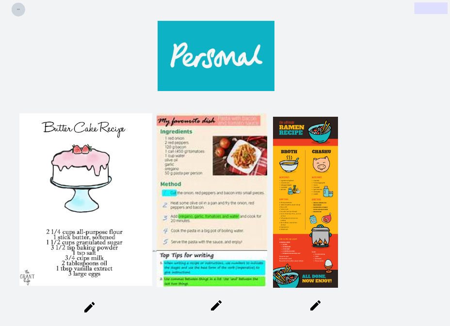
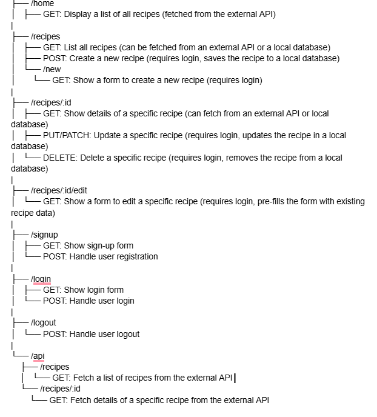
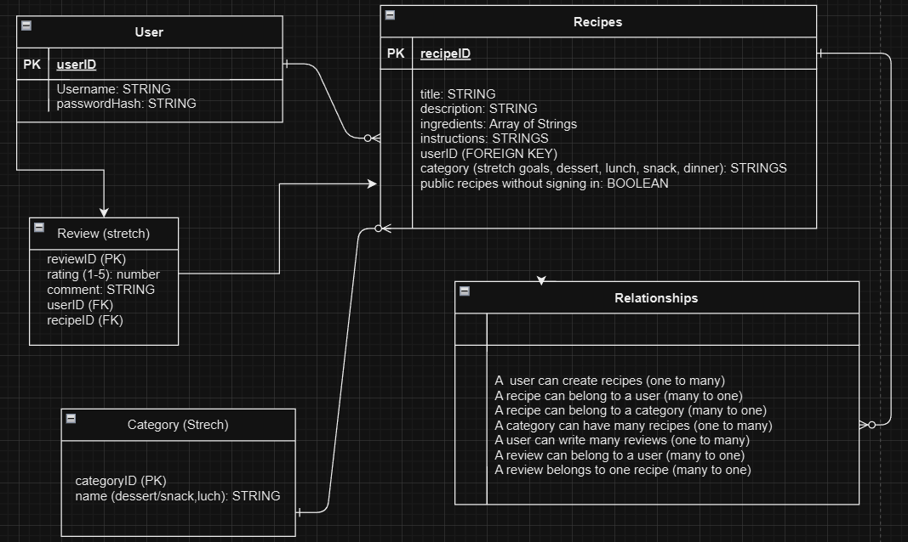

# Recipe CRUD

## User Stories for Recipe CRUD Application
### User Authentication
- As a new user, I want to be able to sign up for an account so that I can save and manage my own recipes.
- As a registered user, I want to be able to log in so that I can access my saved recipes and manage them.
### Recipe Creation
- As a logged-in user, I want to be able to create a new recipe by providing a title, ingredients, and instructions so that I can save and share my favorite recipes.
- As a logged-in user, I want to be able to upload an image for my recipe so that it looks more appealing (might be strech).
### Recipe Viewing (Reading)
- As a logged-in user, I want to see a list of all my saved recipes so that I can easily access and manage them.
- As a user, I want to view details of a specific recipe including title, ingredients, instructions, and image so that I can follow the recipe.
- As a user, I want to search for recipes by title or ingredient so that I can quickly find specific recipes.
### Recipe Updating
- As a logged-in user, I want to be able to edit the details of a recipe, including the title, ingredients, instructions, and image so that I can update or correct any information.
- As a logged-in user, I want to be able to update the recipe's image so that the visual representation of my recipe is accurate.
### Recipe Deletion
- As a logged-in user, I want to be able to delete a recipe so that I can remove recipes that I no longer want to keep.
### Authorization and Access Control
- As a guest user, I want to be able to view a list of recipes but not be able to create, edit, or delete any recipes.
- As a logged-in user, I want to be able to see and manage only my own recipes and not those of other users.
### User Interface and Experience
- As a user, I want the recipe creation and editing forms to be user-friendly and pre-fill existing information when editing so that I can easily make changes.
- As a user, I want to have a clear and intuitive navigation menu so that I can easily find different sections of the application like my recipes, search functionality, and account settings (dark/light mode).
### Feedback and Error Handling
- As a user, I want to receive confirmation when I successfully create, update, or delete a recipe so that I know my action was completed.
- As a user, I want to receive error messages if I try to create or update a recipe with missing required fields so that I can correct the errors.

## Wireframes
### Home Page
Home Page has a sign in and sign up button with clickable pictures to see the recipes. A user can favorite them and they will be added into their homepage.

### Login Page

### Personel User Page

User can see save recipes, create their own, and delete/edit recipes.

## Route Tree & Table
 

| **Method**  | **Path**           | **Description**                                                        | **Authentication Required** |
|-------------|---------------------|------------------------------------------------------------------------|------------------------------|
| `GET`       | `/recipes`          | List all recipes (fetched from an external API or a local database)    | No                           |
| `POST`      | `/recipes`          | Create a new recipe (saves to local database)                           | Yes                          |
| `GET`       | `/recipes/new`      | Show a form to create a new recipe                                     | Yes                          |
| `GET`       | `/recipes/:id`      | Show details of a specific recipe (fetched from an external API or local database)  | No                           |
| `PUT/PATCH` | `/recipes/:id`      | Update a specific recipe (updates in the local database)                | Yes                          |
| `DELETE`    | `/recipes/:id`      | Delete a specific recipe (removes from the local database)              | Yes                          |
| `GET`       | `/recipes/:id/edit` | Show a form to edit a specific recipe (pre-fills with existing data)    | Yes                          |
| `GET`       | `/signup`           | Show sign-up form                                                       | No                           |
| `POST`      | `/signup`           | Handle user registration                                                | No                           |
| `GET`       | `/login`            | Show login form                                                          | No                           |
| `POST`      | `/login`            | Handle user login                                                        | No                           |
| `POST`      | `/logout`           | Handle user logout                                                       | Yes                          |

## ERD

## Project Timeline

### August 3rd (Saturday): Setup and Initial Configuration
- **Set Up Project Environment**
  - Initialize a new Node.js project with `npm init`.
  - Install Express, EJS, and other required dependencies.
  - Set up Express and connect to MongoDB.
  - Configure EJS as the templating engine.
- **Create Initial Routes and Views**
  - Set up basic routes for home, login, and sign-up.
  - Create basic EJS templates for these routes.

### August 4th (Sunday): User Authentication
- **User Registration**
  - Implement the user sign-up functionality.
  - Create a user registration form (EJS template).
  - Implement backend logic to handle registration and save user data to the database.
- **User Login**
  - Implement the user login functionality.
  - Create a login form (EJS template).
  - Implement backend logic for login and session management.

### August 5th (Monday): Recipe Creation
- **Recipe Creation Form**
  - Create an EJS template for the recipe creation form.
  - Implement backend logic to handle recipe creation, including title, ingredients, instructions, and image upload.
- **Recipe Saving**
  - Add functionality to save recipe data to the database.
  - Ensure that image uploads are handled properly.

### August 6th (Tuesday): Recipe Viewing and API Integration
- **Integrate Recipe API**
  - Set up environment variables for API credentials (`.env` file).
  - Create a service file (`apiService.js`) to handle API requests.
- **List of Saved Recipes**
  - Implement functionality to display a list of saved recipes for logged-in users.
  - Create an EJS template for the list view.

### August 7th (Wednesday): Recipe Details and Search
- **Recipe Details**
  - Implement functionality to view details of a specific recipe.
  - Create an EJS template to display recipe details, including title, ingredients, instructions, and image.
- **Recipe Search**
  - Implement search functionality for recipes by title or ingredient using the API.
  - Create a search form and handle search queries on the backend.

### August 8th (Thursday): Recipe Updating
- **Recipe Editing Form**
  - Create an EJS template for the recipe editing form.
  - Implement backend logic to pre-fill the form with existing recipe data.
- **Updating Recipe Data**
  - Implement functionality to update the recipe details, including title, ingredients, instructions, and image.
  - Ensure that updated data is saved correctly in the database.

### August 9th (Friday): Recipe Deletion and Authorization
- **Deleting Recipes**
  - Implement functionality to delete a recipe.
  - Add a delete button or link in the recipe details view.
  - Ensure that deleted recipes are removed from the database.
- **Authorization and Access Control**
  - Implement functionality to allow guest users to view recipes but not create, edit, or delete them.
  - Ensure that logged-in users can only view and manage their own recipes.
  - Implement checks to prevent unauthorized access to other users' recipes.

  ## What was used to build this project?

  - JavaScript
  - CSS
  - Node.js
  - EJS
  - Express
  - MongoDB
  - Mongoose
  - API 

